说明文档
运行前附加数据库.mdf（或sql生成数据库）  
主要技术：
基于asp.net架构和sql server数据库，并采用EF实体模型开发。
asp.net 软件下载系统
开发工具：Visual Studio 2019 、SQL Sever 2019
项目介绍：
软件下载系统是一种利用互联网可以让他人或自己快速准确的定位到想要寻找到的软件资源。本系统基于前后端分离实现。
实现用户登录、软件下载、后台管理、软件上传、用户管理和查询软件等模块
网站功能基本包括：用户管理，文章管理，友情连接，前台首页和系统设置5个模块。
本项目采用三层架构进行开发，其优势在于便于分工合作、易于扩展、便于维护，其三层之间的关系如图17.14所示。其中表示层用于与用户进行交互；业务逻辑层负责处理项目业务流程；数据访问层负责操作数据库；Model层中的实体类是三层之间的数据载体，用于在三层之间传递数据；

前台首页		
 首页按分类呈现文章，设置文章分类之后，可以在首页看到分类的展示效果。
用户管理		
 访问管理后台功能，添加用户信息，修改用户密码。
文章管理	分类管理	 创建文章一、二级分类，网页前台展示分类效果。
内容管理	
 添加文章信息，对文章信息执行查询、删除、编辑，前台网页呈现文章标题列表和文章内容。
友情连接 创建友情链接，对友情链接执行编辑、删除管理，在前台网页中呈现友情链接。
系统设置	系统探针显示系统环境。
	站点设置	
	日志管理对日志记录查看和删除。 

页面预览  
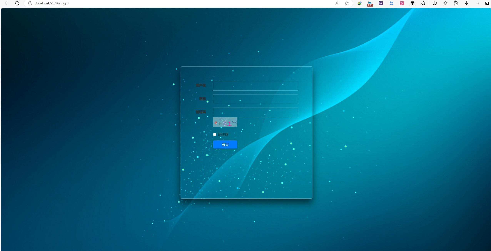

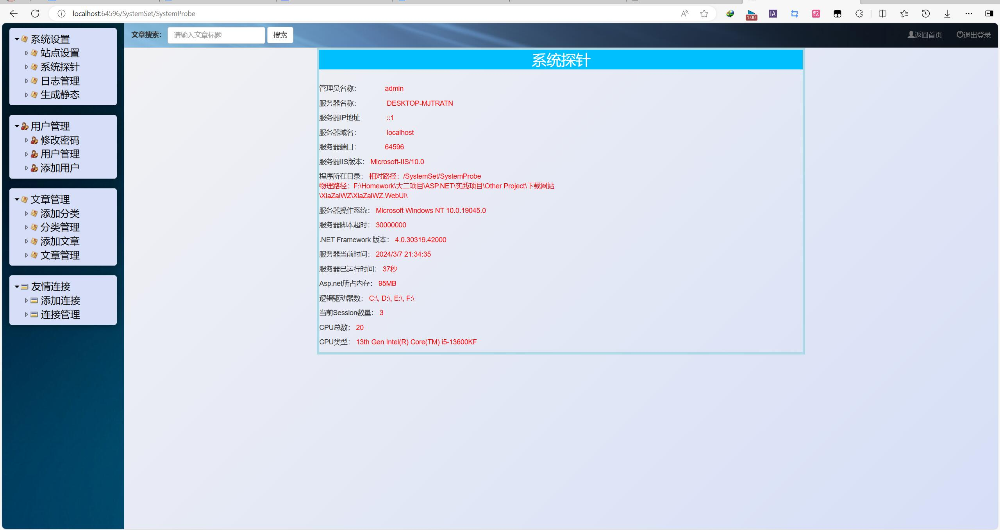

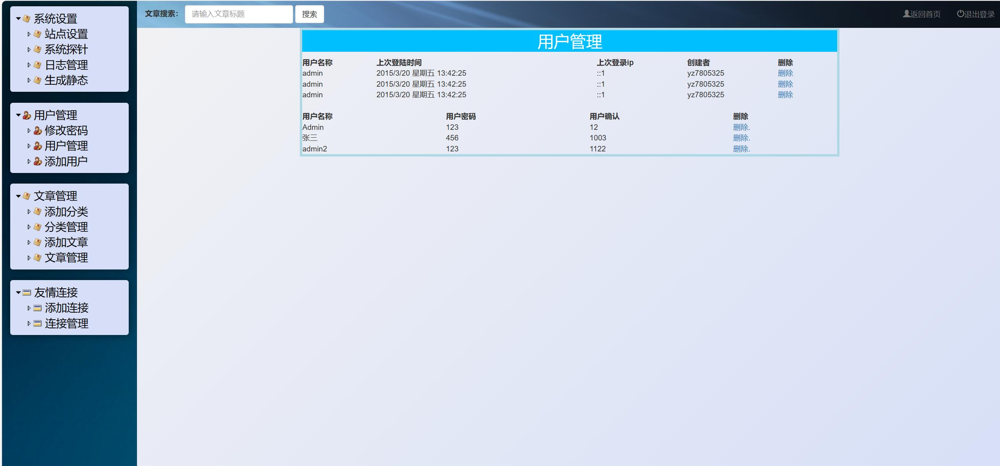

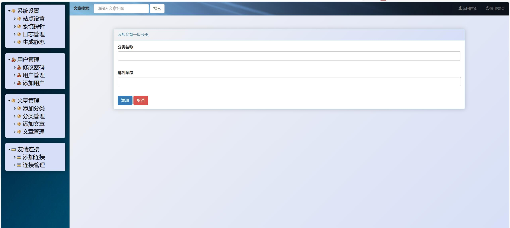

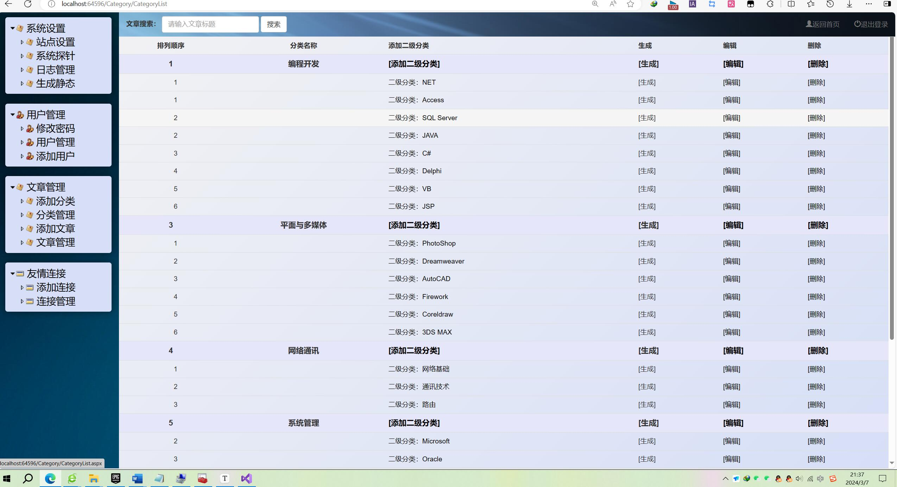

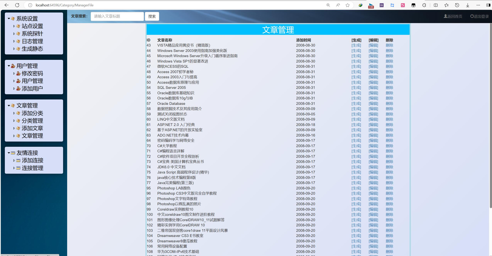

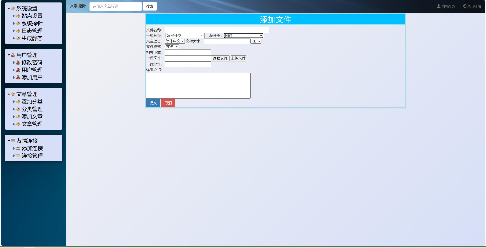

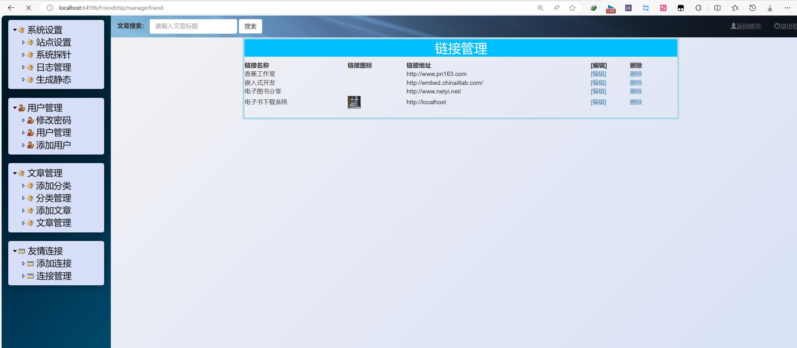

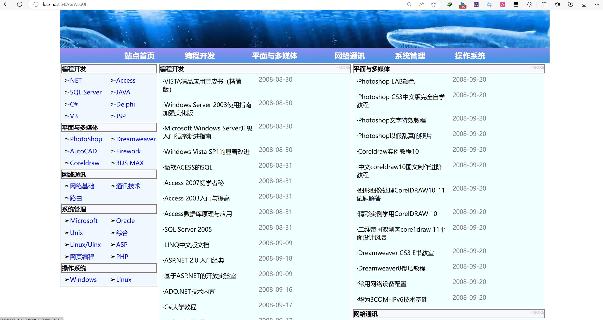

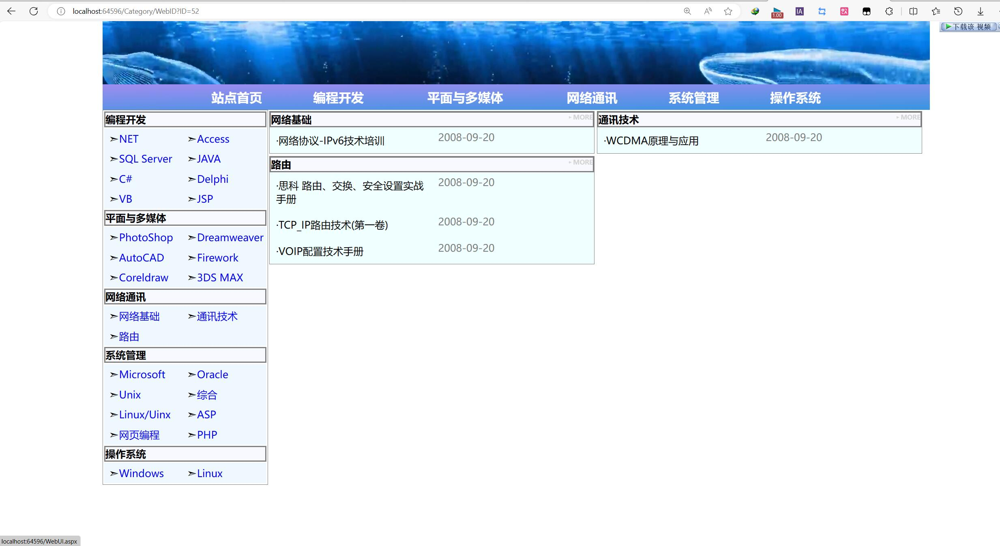

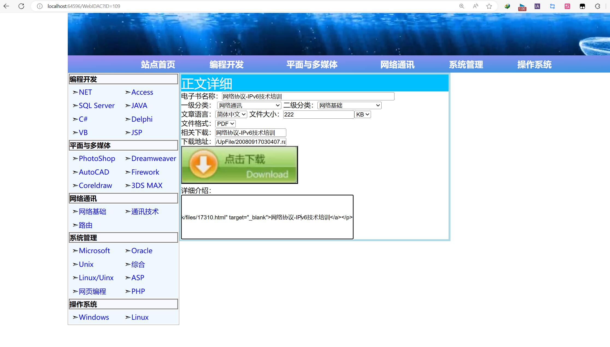
